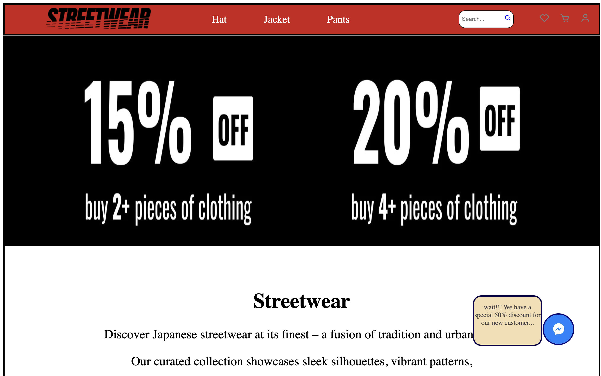

# Streetwear Website

**Description:**  
A streetwear website developed using HTML and CSS during my first semester to practice website design and layout.

**Tech Stack:**  
- HTML  
- CSS  

**Features:**  
- Homepage with showcase of products that are on Sale,
- Separate pages for jackets, pants and hats section,
- Clean navigation and layout,
- Responsive home page & Hat section.

**How to Run:**  
1. Clone or download the repository  
2. Open `index.html` in a web browser  
3. Explore the website layout and styles

**Demo**
Live demo : [Try it here](https://injal123.github.io/Streetwear-Website/)

**Screenshots:**  

 
 
  

